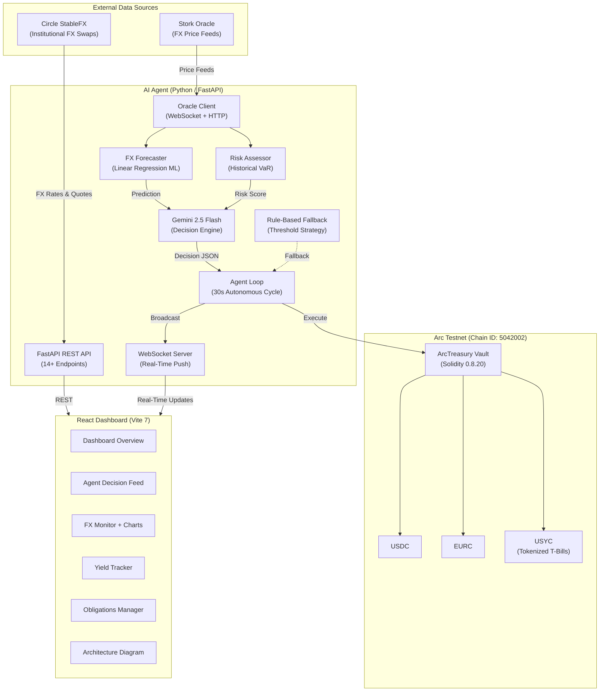

# ArcTreasury — System Architecture

## System Overview

ArcTreasury is an autonomous AI-powered treasury management agent that monitors market conditions, forecasts FX rate movements, assesses risk, and executes optimal treasury operations on-chain — all without human intervention.



## Smart Contract Design

### ArcTreasury Vault (`contracts/ArcTreasury.sol`)

The vault contract is the on-chain settlement layer. It holds all treasury assets and provides controlled access to the AI agent.

**Access Control:**
- `owner` — deployer, full control
- `agent` — AI agent wallet, can execute treasury operations
- `onlyAgent` modifier — allows both owner and agent

**Core Functions:**
| Function | Description |
|----------|-------------|
| `deposit(token, amount)` | Pull ERC20 tokens into the vault |
| `withdraw(token, amount, to)` | Send tokens from vault to recipient |
| `swapFX(fromToken, toToken, amountIn)` | Execute FX swap via StableFX router |
| `depositToYield(amount)` | Park idle USDC into USYC for T-bill yield |
| `withdrawFromYield(amount)` | Withdraw from USYC back to USDC |
| `getBalances()` | View current USDC, EURC, USYC positions |
| `setAgent(address)` | Owner-only: update agent wallet |

**Events:** `FundsDeposited`, `FundsWithdrawn`, `FXSwapExecuted`, `YieldDeposited`, `YieldWithdrawn`, `AgentDecision`

**Deployed on:** Arc Testnet (Chain ID: 5042002, Gas: USDC)

## AI Agent Decision Engine

The decision engine is a multi-stage pipeline that runs every 30 seconds:

```
┌──────────────┐    ┌──────────────┐    ┌──────────────┐
│  1. Fetch    │───▶│  2. Get FX   │───▶│  3. Get      │
│  Balances    │    │  Rate        │    │  Yield Info  │
│  (On-chain)  │    │  (Stork)     │    │  (Oracle)    │
└──────────────┘    └──────────────┘    └──────────────┘
                                              │
┌──────────────┐    ┌──────────────┐    ┌─────▼────────┐
│  6. AI       │◀───│  5. Risk     │◀───│  4. ML       │
│  Decision    │    │  Assessment  │    │  Forecast    │
│  (Gemini)    │    │  (VaR)       │    │  (LinReg)    │
└──────┬───────┘    └──────────────┘    └──────────────┘
       │
┌──────▼───────┐    ┌──────────────┐    ┌──────────────┐
│  7. Record   │───▶│  8. Apply    │───▶│  9. Broadcast│
│  Decision    │    │  Effects     │    │  WebSocket   │
└──────────────┘    └──────────────┘    └──────────────┘
```

### Decision Types

| Action | Trigger | Effect |
|--------|---------|--------|
| `PAYOUT` | Obligation due within 24h | Execute payment to recipient |
| `FX_SWAP` | ML predicts EURC strengthening, or obligation needs EURC | Swap USDC→EURC via StableFX |
| `YIELD_DEPOSIT` | Idle USDC > $50K, no imminent payments | Park in USYC for T-bill yield |
| `YIELD_WITHDRAW` | USDC needed for payment but locked in USYC | Withdraw from USYC to USDC |
| `HOLD` | Treasury is optimally balanced | No action needed |

### ML Forecasting (FXForecaster)

- **Method:** Linear regression on last 24 EURC/USDC rate observations
- **Output:** Direction (up/down/stable), confidence (0.5–0.95 via R²), predicted rate
- **Integration:** High-confidence forecasts override default hold behavior — if EURC is predicted to strengthen >0.1% with >65% confidence, the agent swaps preemptively

### Risk Assessment (RiskAssessor)

- **Concentration Risk:** Alerts if >70% USDC or >50% EURC
- **FX Volatility:** Historical standard deviation of rate returns
- **Value at Risk:** 95th and 99th percentile loss estimates
- **Idle Capital Risk:** Flags if USDC > $100K and <30% in yield-bearing USYC
- **Output:** Composite score 0–100, classified as Low/Moderate/High

### AI Layer (Gemini 2.5 Flash)

When `AI_API_KEY` is configured, all inputs are packaged into a structured prompt and sent to Google Gemini 2.5 Flash. The model returns a JSON decision with:
- `action` — one of the 5 action types
- `reason` — natural language explanation
- `amount` — dollar amount to move
- `token` — asset pair involved
- `confidence` — model's self-assessed confidence

If Gemini is unavailable, the system falls back to the rule-based `TreasuryStrategy` which uses threshold logic.

## Frontend Dashboard

Built with React 19, Vite 7, and Tailwind CSS v4.

| Page | Purpose |
|------|---------|
| **Dashboard** | Hero stats (USDC/EURC/USYC), total treasury value, risk score, yield chart, recent decisions, upcoming obligations |
| **Agent** | Full decision feed with AI reasoning, confidence scores, linked transactions |
| **FX Monitor** | Live EURC/USDC chart, StableFX rate/quote display, ML forecast overlay |
| **Yield** | Cumulative yield chart, deposit/withdrawal history, APY tracking |
| **Obligations** | Payment schedule, status tracking, add new obligations |
| **Architecture** | Interactive system diagram |

**Real-Time Updates:** WebSocket connection pushes agent decisions to all connected clients instantly.

**Animations:** Framer Motion for page transitions, `useCountUp` hook for animated number displays, heartbeat pulse for agent status.

## Tech Stack

| Layer | Technology |
|-------|-----------|
| Smart Contracts | Solidity 0.8.20+, OpenZeppelin, Hardhat |
| Blockchain | Arc Testnet (Chain ID: 5042002, USDC gas) |
| Backend | Python 3.12, FastAPI, Web3.py, uvicorn |
| AI | Google Gemini 2.5 Flash (`google-genai` SDK) |
| ML | NumPy, scikit-learn (linear regression) |
| FX | Circle StableFX API |
| Oracle | Stork Network (WebSocket + HTTP) |
| Frontend | React 19, Vite 7, Tailwind CSS v4 |
| Charts | Recharts (AreaChart, ResponsiveContainer) |
| Animations | Framer Motion |
| Icons | Lucide React |

## Data Flow Summary

```
Market Data (Stork/StableFX)
    ↓
ML Forecast + Risk Assessment
    ↓
AI Decision (Gemini 2.5 Flash)
    ↓
On-Chain Execution (Arc Testnet)
    ↓
WebSocket Broadcast → Dashboard Update
```

Built by Mohammed Rafeeq Faraaz Shaik for the Encode x Arc Enterprise & DeFi Hackathon, February 2026.
